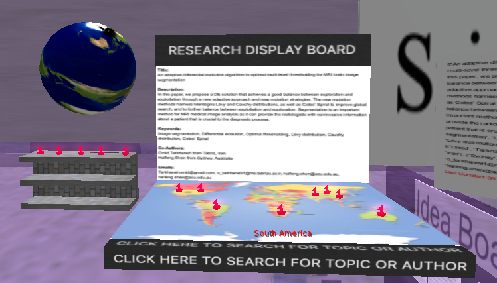

# Network Diagram Research Map

This was an Air Force sponsored project during the Discovery Lab Global 10 week Artificial Intelligence program. The sponsor representative Mr. Sherry requested our team to create a system to help researchers share, collaborate, and visualize information in virtual reality. There were three teams of three students each. I used my position as a team lead to prep my team on foundational material and collaborate on several programming tasks in Python and the Linden Scripting Language. You will need to get a proxycrawl.com token to use this program. 

This project scrapes sciencedirect.com for details on research papers (title, description, authors, location, and email) regarding any topic or author chosen by the user and plots the details on a world map in the Second Life virtual reality environment. This research map allows the user to view where the most current research is published around the globe. If an author is used as a search query then the map displays the scope of an author's worldwide influence when publishing research. 

   
  <b>Network Diagram Research Map Model</b> 

   
  <b>One of Many Project Meetings in the Virtual World</b> 

## Available Code

TimeStampedLineByLineTextOnPrim.lsl is the script placed in a prim in-world. This prim will produce an ID URL when first activated. This ID URL can be used to communicate to the prim from outside the in-world environment through a POST request. Text received by the prim through the ID URL is printed on the prim and timestamped.

findClosestPoint.py returns the closest global coordinate location from a location list when given any address on the globe. This is used to locate high profile points on the research map in precise coodinate mapping is not implemented.

textSummarizer.py will summarize the text on any webpage given a URL using extractive summarization (ie. Input document → sentences similarity → weight sentences → select sentences with higher rank). An future improvement would be to use abstractive summarization (ie. Input document → understand context → semantics → create own summary).

getArticleInfo.py scrapes sciencedirect.com, a leading website for research papers, for the first 25 research papers on any topic or author and then extracts the useful details on each paper ((title, description, authors, location, and email) using BeautifulSoup. Then these details are then sent to an in-world prim via a POST request.

